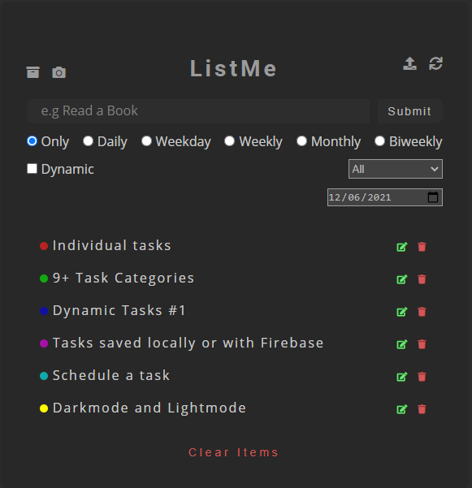

<h1 align="center">ListMe</h1

    <a href="https://github.com/ItaloPussi/simpleProjectsJS/blob/master/listMe/readme.pt.md">Versão em Português</a>

<h1 align="center">
  
</h1>

✍✍✍ TodoList is one of the most common projects in programming. This does not mean that it is futile, with it we can work with important concepts of any language, in addition to becoming an interesting project to use in everyday situations.

 <a href="#project">Project</a> •
 <a href="#functionalities">Functionalities</a> •
 <a href="#technologys">Techonologys</a> • 
 <a href="#contributing">Contributing</a> • 
 <a href="#license">Licence</a>

<h2 id="project">Project</h2>

To visualize and use the application locally just access the link: <a href="https://italopussi-listme.netlify.app/">https://italopussi-listme.netlify.app/</a>

If you want to connect it to firebase and have access to your lists from anywhere, edit the file firebase.js and enter the configuration variables. Don't forget to enable the project's storage.

After that you'll need to deploy the application on a private server. For instance: netlify connected with your Github accont.

<h2 id="functionalities">Functionalities</h2>
    - Create a task and choose between 8 possibilities;
    - Choose the recurrence of your task: Only, Daily, Weekly, Monthly and weekdays;
    - With the special dynamic type you can define how long your task will last (in days), in addition to the current day of the same. To use it, fill in the "Dynamic" option, in addition to placing a dollar sign ($) somewhere on the task to identify the day;
    - Do you want to plan your next week now? Simply schedule the initial display day;
    - Filter existing tasks according to their type; 
    - Take an automatic screenshot of completed tasks of your day;
    - Connect the project to firebase and access your tasks from anywhere. Don't wanna do that? Just continue to save your tasks locally;
    - Dark and Light mode!

<h2 id="technologys">Techonologys</h2>
<ul>
    <li>Local Storage</li>
    <li>Dom to Image</li>
    <li>Firebase</li>
    <li>FileSaver</li>
    <li>Conditional exibition of DOM elements</li>
</ul>

<h2 id="contributing">Contributing</h2>

Found some bug or have an interesting contribution? Fell free to contribute!

<h2 id="license">Licence</h2>

Commercial use of this project is not allowed without the prior authorization of this author.

