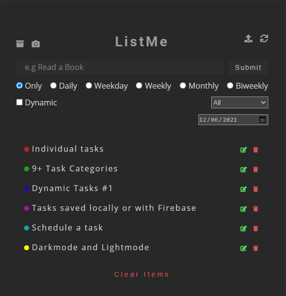

<h1 align="center">ListMe</h1>

    <a href="https://github.com/ItaloPussi/simpleProjectsJS/blob/master/listMe/readme.md">English Version</a>

<h1 align="center">
  
</h1>

✍✍✍ TodoList ou Lista de Afazares é um dos projetos mais comuns em programação. Nem por isso significa que é algo fútil, com ela podemos trabalhar conceitos importantes de qualquer linguagem, além de se tornar um projeto interessante de se utilizar no cotidiano.

 <a href="#projeto">Projeto</a> •
 <a href="#funcionalidades">Funcionalidades</a> •
 <a href="#tecnologias">Tecnologias</a> • 
 <a href="#contribuicao">Contribuição</a> • 
 <a href="#licenca">Licença</a>

<h2 id="projeto">Projeto</h2>

Caso queira visualizar e usar a aplicação localmente acesse esse link: <a href="https://italopussi-listme.netlify.app/">https://italopussi-listme.netlify.app/</a>

Se você quiser conecta-la ao firebase e ter acesso a suas tarefas de qualquer lugar edite o arquivo firebase.js e insira as variáveis de configuração. Não se esqueça de habilitar o storage do projeto no firebase.

Após isso, você precisará realizar o deploy da sua aplicação em algum servidor próprio. Como o netlify conectado ao seu Github.

<h2 id="funcionalidades">Funcionalidades</h2>
- Crie uma tarefa e escolha o tipo dentre 9 possibilidades existentes; 
- Escolha a recorrência de sua tarefa: Única, Diária, semanal, mensal, quinzenal e dias uteis (segunda á sexta); 
- Com o tipo especial dinâmico você poderá definir quanto tempo sua tarefa irá durar (em dias), além do dia atual da mesma. Para utiliza-lo, preencha a opção "Dynamic", além de  colocar um cifrão ($) em algum lugar da task para identificação do dia.  
- Quer planejar desde já sua próxima semana? Simplesmente agende o dia inicial de display! 
- Filtre as tarefas existentes de acordo com seu tipo;  
- Tire uma screenshot automática das tarefas completadas em seu dia; 
- Conecte o projeto ao Firebase e acesse suas tarefas de qualquer lugar. Não quer? Simplesmente continue salvando-as localmente; 
- Modo claro e modo escuro! 

<h2 id="tecnologias">Tecnologias</h2>
<ul>
    <li>Local Storage</li>
    <li>Dom to Image</li>
    <li>Firebase</li>
    <li>FileSaver</li>
    <li>Exibição condicional de elementos</li>
</ul>

<h2 id="contribuicao">Contribuição</h2>

Achou algum bug ou tem uma contribuição a fazer? Sinta-se livre.

<h2 id="licenca">Licença</h2>

Não é permitido o uso comercial desse projeto sem a prévia autorização desse autor.

