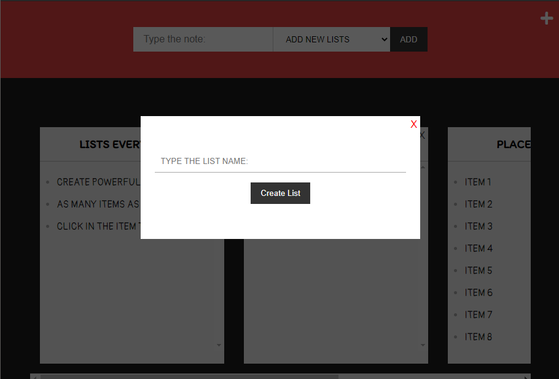

<h1 align="center">Lists Everywhere</h1>

    <a href="https://github.com/ItaloPussi/simpleProjectsJS/blob/master/listsEverywhere/readme.pt.md" />Versão em Português</a>

<h1 align="center">
  
</h1>

📄📄📃 In this repo you'll find a list manager created to auxiliate you to manage your best ideas and needs.

 <a href="#project">Project</a> •
 <a href="#technologys">Techonologys</a> • 
 <a href="#contributing">Contributing</a> • 
 <a href="#license">Licence</a>

<h2 id="project">Project</h2>

  
  
 

 

 To test the application just access the link: <a href="https://italopussi-listseverywhere.netlify.app/">https://italopussi-listseverywhere.netlify.app/</a>

 
<h2 id="technologys">Tecnologys</h2>

<ul>
  <li>CSS Overflow</li>
  <li>Modal</li>
  <li>Local Storage</li>
</ul>

<h2 id="contributing">Contributing</h2>

Found some bug or have an interesting contribution? Fell free to contribute!

<h2 id="licence">Licence</h2>
<a href="https://choosealicense.com/licenses/mit/" target="_blank" />MIT</a>

