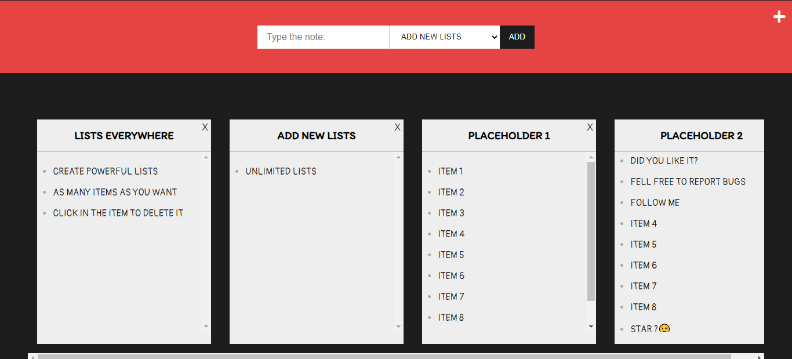
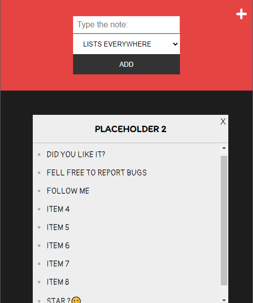

<h1 align="center">Lists Everywhere</h1>

    <a href="https://github.com/ItaloPussi/simpleProjectsJS/blob/master/listsEverywhere/readme.md" />English Version</a>

<h1 align="center">
  
</h1>

📄📄📃 Nesse repositório você encontrará um gerenciador de listas feito para te auxiliar a gerenciar suas melhores idéias e necessidades.

 <a href="#projeto">Projeto</a> •
 <a href="#tecnologias">Tecnologias</a> • 
 <a href="#contribuicao">Contribuição</a> • 
 <a href="#licenca">Licença</a>

<h2 id="projeto">Projeto</h2>

  
  
 

 

Caso queira visualizar a aplicação em produção acesse esse link: <a href="https://italopussi-listseverywhere.netlify.app/">https://italopussi-listseverywhere.netlify.app/</a>

 
<h2 id="tecnologias">Tecnologias</h2>

<ul>
  <li>CSS Overflow</li>
  <li>Modal</li>
  <li>Local Storage</li>
</ul>

<h2 id="contribuicao">Contribuição</h2>

Achou algum bug ou tem uma contribuição a fazer? Sinta-se livre.

<h2 id="licenca">Licença</h2>
<a href="https://choosealicense.com/licenses/mit/" target="_blank" />MIT</a>

