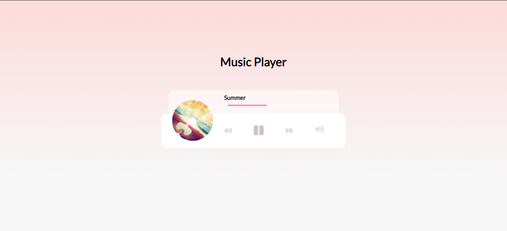

<h1 align="center">Music Player</h1>

    <a href="https://github.com/ItaloPussi/simpleProjectsJS/blob/master/musicPlayer/readme.pt.md" />Versão em Português</a>

<h1 align="center">
  
</h1>

🎶🎶🎵 In this repo you'll find a Music Player made with vanilla JS.

 <a href="#project">Project</a> •
 <a href="#technologys">Techonologys</a> • 
 <a href="#contributing">Contributing</a> • 
 <a href="#credits">Credits</a> • 
 <a href="#license">Licence</a>

<h2 id="project">Project</h2>

 To test the application it is necessary clone this repo and initiate the index.html file of this subfolder

 
<h2 id="technologys">Tecnologys</h2>

<ul>
  <li>CSS Animations</li>
  <li>Audio tag</li>
  <li>Event listeners</li>
</ul>

<h2 id="contributing">Contributing</h2>

Found some bug or have an interesting contribution? Fell free to contribute!

<h2 id="credits">Credits</h2>

The base of this project is avaliable on <a href="https://www.youtube.com/watch?v=QTHRWGn_sJw" target="_blank">Traverse Media</a> channel.

<h2 id="licence">Licence</h2>
<a href="https://choosealicense.com/licenses/mit/" target="_blank" />MIT</a>

