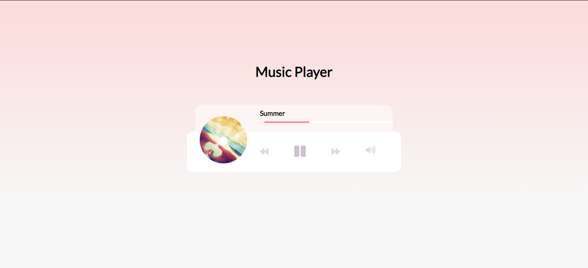

<h1 align="center">Music Player</h1>

    <a href="https://github.com/ItaloPussi/simpleProjectsJS/blob/master/musicPlayer/readme.md" />English Version</a>

<h1 align="center">
  
</h1>

🎶🎶🎵 Nesse repositório você encontrará um tocador de músicas desenvolvido com javascript puro

 <a href="#projeto">Projeto</a> •
 <a href="#tecnologias">Tecnologias</a> • 
 <a href="#contribuicao">Contribuição</a> • 
 <a href="#creditos">Creditos</a> • 
 <a href="#licenca">Licença</a>

<h2 id="projeto">Projeto</h2>

Para testar a aplicação é necessário clonar esse repositório e iniciar o arquivo index.html dessa subpasta.

 
<h2 id="tecnologias">Tecnologias</h2>

<ul>
  <li>Animações CSS</li>
  <li>Tag audio</li>
  <li>Event listeners</li>
</ul>

<h2 id="contribuicao">Contribuição</h2>

Achou algum bug ou tem uma contribuição a fazer? Sinta-se livre.

<h2 id="creditos">Creditos</h2>

A base desse projeto está disponível no canal da <a href="https://www.youtube.com/watch?v=QTHRWGn_sJw" target="_blank">Traversy Media</a> (em inglês)

<h2 id="licenca">Licença</h2>
<a href="https://choosealicense.com/licenses/mit/" target="_blank" />MIT</a>

